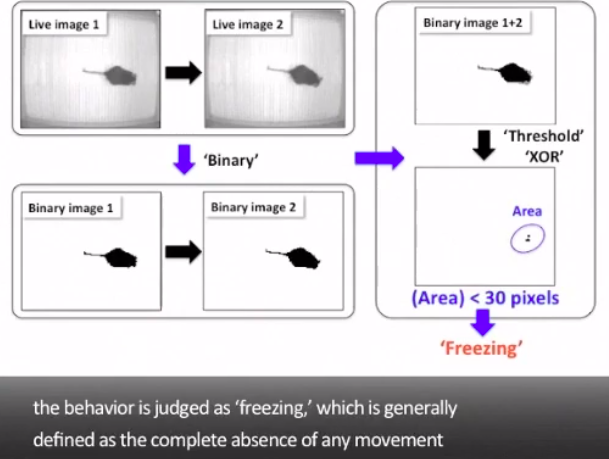

# mice-freeze-detection

[](https://github.com/eggplants/mice-freeze-detection/actions/workflows/build.yml)

- Detection of freezing mice

## Reference

- <https://pubmed.ncbi.nlm.nih.gov/24637495/>

- <https://www.jove.com/v/50871/contextual-cued-fear-conditioning-test-using-video-analyzing-system>

## Install Dependencies

```python
pip3 install -U pip
pip3 install -r requirements.txt
```

## Algorithm


